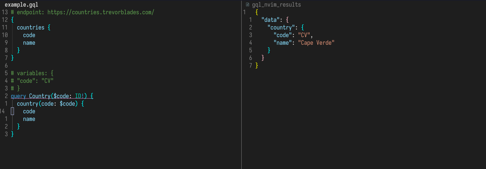

<div align='center'>

# gql.nvim

Simple graphql client for Neovim



</div>

Inspired by [rest.nvim](https://github.com/NTBBloodbath/rest.nvim)

## Dependencies
This plugin uses `curl` to send the requests. You need to rave `curl` installed in your system.
It uses `treesitter` to identify the queries. You need `treesitter` installed in your neovim instance and the `graphql` parser.

```vim
:TSInstall graphql
```

## Instalation

#### Via Packer
```lua
use 'ulisses-cruz/gql.nvim'
```

## Configuration

#### Via Packer
```lua
use { 
  'ulisses-cruz/gql.nvim', 
  config = function()
    require 'gql'.setup {
      fileTypes = { 'graphql' },
      keymaps = { 
        run = '<leader>rn'
      }
    }  
  end
}
```
There are only to configuration options for now:
- **fileTypes**: A list of file types the plugin shoul attach to. Defaults to `{ 'graphql' }`.
- **keymaps**: A table of action/keymap pairs. Currently there's only the `run` action. It has no default keymap.

## Usage

1. Go to a `graphql` file where you have your queries;
2. Put the cursor on the query you what to run (not the query metadata);
3. press the keymap you set in your configuration;

You should be prompt to enter the `endpoint` the query should be sent to. After entering the `endpoint` a split window should open to show the query response.

If you don't want to enter the `endpoint` every time, add it as a metadata to the query. 
You can do that by adding `# endpoint: <your-endpoint>` above the query.

```graphql
# endpoint: https://countries.trevorblades.com/
{
  countries {
    code
    name
  }
}
```

You can also configure a default endpoint for all queries in the file, by adding the metadata as the **first line** of the file. 
The metadata added above each query has precedence.

```graphql
# endpoint: https://countries.trevorblades.com/

{
  countries {
    code
    name
  }
}

query Country($code: ID!) {
  country(code: $code) {
    code
    name
  }
}

```
If your query requires any variable, you can set them as metadata also:

```graphql
# variables: {
#   "code": "CV"
# }
query Country($code: ID!) {
  country(code: $code) {
    code
    name
  }
}
```
